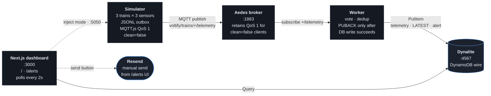

# Voltify Telemetry Pipeline

Prototype telemetry pipeline for the Voltify senior-SWE take-home. Three simulated
locomotives publish battery-pack temperature over MQTT; a worker votes across the
three redundant sensors per train, writes to DynamoDB, and flags anomalies. A
Next.js dashboard shows live fleet state and recent alerts.

Everything runs locally under Node. No Docker, no AWS account, no Java.

## Architecture



<details>
<summary>ASCII fallback (for plain-text viewers)</summary>

```
┌──────────────────────┐       ┌──────────────────┐
│ Simulator            │ MQTT  │ Aedes broker     │
│  3 trains            │──────▶│  pure-Node       │
│  3 sensors / train   │ QoS 1 │  :1883           │
│  JSONL outbox (edge  │       │  retains for     │
│  store-and-forward)  │       │  clean=false     │
└──────────────────────┘       └────────┬─────────┘
                                        │ MQTT sub
                                        ▼
                                ┌──────────────────┐      ┌─────────┐
                                │ Worker           │      │ Resend  │
                                │  vote()          │      │ manual  │
                                │  ack-after-DB    │      │ send    │
                                │  alert dedup     │      │ from UI │
                                └────────┬─────────┘      └─────────┘
                                         │ PutItem
                                         ▼
                                ┌──────────────────┐
                                │ Dynalite         │
                                │  pure-Node DDB   │
                                │  :4567           │
                                └────────┬─────────┘
                                         │ Query
                                         ▼
                                ┌──────────────────┐
                                │ Next.js          │
                                │  /       fleet   │
                                │  /alerts feed    │
                                │  polls every 2s  │
                                └──────────────────┘
```

</details>

**Three store-and-forward hops**, each with its own ack:

| Hop | Queue | Deletes when... |
|---|---|---|
| Sim → Broker | `outbox-{train_id}.jsonl` + in-memory Map | `client.publish` callback fires (broker PUBACK) |
| Broker → Worker | Aedes retention for `clean=false` subscriber | Worker calls `cb()` in `handleMessage` |
| Worker → Dynalite | In-memory message held until DB write | `PutCommand` returns 200 |

This chain means nothing is deleted from any queue until the next hop has confirmed
durable receipt. MQTT.js defaults to ack-on-dispatch; we explicitly override
`client.handleMessage` in the worker so PUBACK only fires **after** all DB writes
succeed (see `src/worker/index.ts`).

## Data packet

Each locomotive has three temperature sensors physically colocated on the battery
pack. The simulator **collects all three at the same instant and packages them
into a single queue entry** — one `SensorReading` per tick, not three. That same
packet is what goes on the outbox, on the wire over MQTT, and into the database.
Voting requires all three values together, so splitting them would only force
the worker to reassemble them later.

```ts
// src/shared/types.ts
type SensorReading = {
  train_id: string                                      // e.g. "TR-001"
  reading_id: string                                    // ulid, idempotency key
  ts: string                                            // ISO-8601 at capture time
  sensors: { s1: number; s2: number; s3: number }       // °C, all three together
}
```

Example wire payload (JSON, published with QoS 1):

```json
{
  "train_id": "TR-003",
  "reading_id": "01KPR1ZBXE8V2M9MTP85DDBYAG",
  "ts": "2026-04-21T12:55:14.238Z",
  "sensors": { "s1": 27.8, "s2": 39.9, "s3": 51.6 }
}
```

- **Topic:** `voltify/trains/{train_id}/telemetry` (one per train).
- **Subscription:** the worker subscribes to `voltify/trains/+/telemetry` (one stream).
- **Size:** ~137 bytes per reading.
- **Cadence:** 1 Hz per train by default (`--tick-ms` to change). This is a
  prototype demo rate. Real locomotives emit aggregated telemetry at roughly
  1-10 Hz and raw sensor channels at higher rates; production would tune this
  up and add motor current, SoC, GPS, speed, and faults alongside temperature.
  Higher per-train frequency × thousands of trains is the main reason to
  consider a true wide-column store at scale (see
  [Why DynamoDB](#why-dynamodb-not-cassandra-not-mongodb) below). The pipeline
  itself (MQTT topic, JSON packet, voting, three-hop ack) doesn't change.
- **Atomicity:** because the three sensors are one packet, a network blip either
  delivers a complete reading or none at all. The worker never sees a partial
  triple. The `reading_id` also means a duplicate delivery overwrites the same
  DB row rather than producing a second (partial) record.

The outbox queues the **whole packet** as one unit. `outbox.size()` counts
readings (not sensors), and a single `ack` clears all three sensor values for
that reading in one write.

## Data model

Single DynamoDB table named `voltify`, two-attribute key schema (`pk` HASH, `sk`
RANGE). Three item types live side-by-side. Access patterns map to either a
`Query` on a single partition or a composite `GetItem`. No scans.

| Item type        | `pk`             | `sk`                               | What it holds                    |
|------------------|------------------|------------------------------------|----------------------------------|
| Per-reading      | `TRAIN#TR-001`   | `TELEMETRY#2026-04-21T12:55:14.238Z#01KPR1ZB…` | Every reading: voting result + sensors + ts |
| Fleet LATEST     | `FLEET`          | `TRAIN#TR-001`                     | Newest reading per train, overwritten every tick |
| Alert            | `ALERTS`         | `2026-04-21T12:55:14.238Z#TR-001#01KPR1ZB…`     | WARN/CRITICAL rows + email status fields |

Access patterns:

| UI / API need      | DDB call                                                  |
|--------------------|-----------------------------------------------------------|
| Fleet overview     | `Query pk=FLEET`, one round-trip returns every train's latest |
| Alerts feed        | `Query pk=ALERTS, ScanIndexForward=false, Limit=50`       |
| Per-train history  | `Query pk=TRAIN#{id}, sk begins_with TELEMETRY#`          |
| Single alert (send) | `GetItem { pk=ALERTS, sk=<ts>#<train>#<rid> }`           |

Alert items carry extra fields the worker doesn't populate on first write but
the `/api/alerts/send` route updates on dispatch: `email_status`
(`pending` | `sent` | `failed`), `email_sent_at`, `email_provider_id`,
`email_error`. A conditional `UpdateExpression` guards the send so duplicate
clicks can't double-dispatch.

## Why DynamoDB (not Cassandra, not MongoDB)

DynamoDB is strictly *"key-value and document"* in AWS's own taxonomy — **not
wide-column** in the Cassandra/ScyllaDB/Bigtable sense, and definitely not a
document store like MongoDB. But the partition+sort access pattern we use here
(`pk=TRAIN#{id}`, `sk=TELEMETRY#{ts}#{rid}`, row-per-event, schemaless
attribute bag, time-sorted within a partition) **overlaps heavily** with
wide-column in practice for time-series telemetry.

What we actually picked and why:

- **`dynalite`** for local dev: pure Node, speaks the real DynamoDB HTTP wire
  protocol, so the exact same `@aws-sdk/client-dynamodb` code runs against it
  here and against real AWS DynamoDB in prod. Zero install (no Docker, no
  Java, no JAR download).
- **DynamoDB proper** for real deployment: on-demand billing matches bursty
  telemetry, TTL for retention, 25 GB free tier, and our `Query`-only access
  patterns stay well under the partition hot-key limits at fleet scale.

What I'd pick for bigger volume:

- At **thousands of trains × 10 Hz** (≈tens of millions of writes/day), I'd
  evaluate **Cassandra / ScyllaDB**. The data model ports unchanged: `train_id`
  as partition key, `timestamp` as clustering column, sensor bag on the row.
  Cassandra adds linear horizontal scaling and per-query tunable consistency
  (write `LOCAL_ONE`, read `LOCAL_QUORUM` for dashboards), which DynamoDB
  doesn't expose as directly.
- Why didn't I use Cassandra here? There's no pure-Node Cassandra-wire
  emulator; running real Cassandra requires Docker or a hosted cluster, which
  the assignment said to avoid. Dynalite preserves the "works offline" property.

MongoDB was never on the table. Document stores aren't the right fit for
time-series with a strong partition+sort access pattern, and we don't need
document flexibility. Every reading has the same shape.

## Run it

```bash
npm install
npm test          # 18 tests: voting, outbox replay, end-to-end pipeline, alert dedup
npm run dev       # broker + db + worker + web + simulator, all under one concurrently
```

Then open http://localhost:3000.

### Run it in two terminals (nicer for demoing disconnect)

```bash
# terminal 1: the "cloud"
npm run dev:cloud

# terminal 2: the trains
npm run dev:trains
```

Ctrl+C terminal 2 to demo a full fleet disconnect. Watch the dashboard cards go
`STALE`. Restart and watch them resume: readings keep their original timestamps
(not the reconnect time), because the outbox preserved them.

### Full store-and-forward demo (broker outage)

The two-terminal setup above demonstrates the dashboard's STALE handling. The
more compelling test — where the simulator keeps generating during an outage
and drains a large backlog on reconnect — needs the services started
independently so the broker can be killed on its own:

```bash
# terminal 1
npm run db

# terminal 2
npm run broker

# terminal 3
npm run worker

# terminal 4
npm run simulator -- --trains 3
```

With all four running, Ctrl+C terminal 2 (the broker only). The simulator
keeps ticking at 1 Hz; every publish fails and is held in
`data/outbox-<train>.jsonl`. The simulator logs show `outbox=N` climbing
monotonically. No writes reach DynamoDB during the outage because the worker
can't subscribe to a dead broker.

Restart `npm run broker` in terminal 2. Within a few seconds the simulator
reconnects, the outbox drains in order, and the worker writes the backlog to
DynamoDB with the **original capture timestamps**, not the reconnect time. A
60-second outage produces around 60 replayed readings per train (at the default
1 Hz). To verify timestamp preservation, query DynamoDB for rows with `ts`
between the kill and restart wall-clock times — they will all be there.

(Add `npm run web` in a fifth terminal if you also want the backlog to render
on the dashboard.)

### Inject anomalies

Two ways, both hit the same simulator state:

**From the dashboard.** Each train card has an `inject` row with three buttons:
`OK` / `WARN` / `CRITICAL`. Clicking flips the simulator's mode for that train
in place; within one tick the sensor values change and the status chip updates.
The active mode stays highlighted on the card. Backed by a small control HTTP
server on port 5050 (`POST /trains/:id/mode` → simulator), proxied via
`/api/trains/:id/mode`.

**From the CLI**, at start time:

```bash
npm run simulator -- --trains 3 --warn=TR-002 --critical=TR-003
```

- `TR-001` stays `OK`.
- `TR-002` reports one sensor 15°C above the others → worker flags **WARN** with `outlier: s3`.
- `TR-003` reports all three sensors far apart → worker flags **CRITICAL**.

Other flags:

- `--flaky`: simulator drops the MQTT connection for 4-10s every 15-35s. Outbox
  accumulates during the outage and drains on reconnect.
- `--tick-ms 500`: faster demo tick.

### Alert emails (manual send)

Emails are **not** sent automatically. The worker marks each WARN/CRITICAL
alert with `email_status: pending` and writes it to DynamoDB. The dashboard
`/alerts` page shows a **send** button next to each pending row. Clicking
prompts for the recipient email (remembered in `localStorage` for the session
so you only type it once), then dispatches via Resend. The row flips to `sent`
with the provider id and sent-at timestamp.

This is deliberate:

- **No surprise emails** during the demo. You control when alerts go out.
- **You can narrate the send** to the interviewer ("now I click send, and
  Resend returns a message id, and the DDB row is updated with the provider
  id via a conditional `UpdateExpression` so double-clicks can't double-send").
- **Real send works** with `RESEND_API_KEY` set in `.env` (gitignored); leave
  unset and sends fall back to a `[resend/stub]` console log.

## Testing

`npm test` runs 18 cases against the actual pipeline (not mocks):

- `voting.test.ts`: 9 cases over the pure voting function, including the
  boundary at exactly THRESHOLD and the `[20, 22, 24]` drift case that has to
  escalate to CRITICAL.
- `outbox.test.ts`: 6 cases covering enqueue, ack, hydrate-from-disk,
  idempotent double-ack, and recovery from a malformed JSONL line.
- `pipeline.smoke.test.ts`: 3 end-to-end tests. Each one boots aedes and
  dynalite on random ports, starts the worker pointed at them, publishes
  through a real MQTT client, and asserts against DynamoDB. Covers the
  happy path, the CRITICAL + `email_status: pending` write, and the
  conditional-put alert dedup on redelivery.

Manual verification I ran before calling this done:

1. `npm run dev` with three trains, all three green.
2. Clicked **WARN** on TR-002; within a tick the chip flipped yellow and the
   s3 tile highlighted as the outlier. Same for **CRITICAL** on TR-003 (red).
3. On `/alerts`, clicked **send** on a pending row, typed my email, got a
   real message back through Resend (provider id
   `98169d95-a428-4f72-85fb-61936a4ba004`), and confirmed the DDB row flipped
   from `pending` to `sent` with that provider id.
4. Killed the simulator process; watched all three cards flip to `STALE`
   after ~5s. Restarted and they resumed without gaps (timestamps come from
   the original capture, not the reconnect).

## What's included

- **Simulator** (`src/simulator/`): 3-sensor temperature model, MQTT.js QoS 1 +
  `clean: false`, append-only JSONL outbox with crash-safe replay, `--flaky`
  mode that drops the TCP socket mid-run to exercise reconnect/outbox drain,
  and a small HTTP control server on `:5050` that accepts `POST /trains/:id/mode`
  so the dashboard can change a train's mode live.
- **Aedes broker** (`src/infra/broker.ts`): pure-Node MQTT 3.1.1, logs every
  publish for visibility during the demo.
- **Dynalite** (`src/infra/db.ts`): pure-Node DynamoDB; the same
  `@aws-sdk/client-dynamodb` code runs against it here and against real AWS
  DynamoDB in prod. Table is created on boot if missing (idempotent).
- **Worker** (`src/worker/`): overridden `handleMessage` so PUBACK is deferred
  until the DB write succeeds; conditional-put alert dedup so redelivered
  messages don't produce duplicate alert rows; writes alerts with
  `email_status: pending` (manual-send flow, see below).
- **Voting function** (`src/shared/voting.ts`): absolute-threshold triple
  modular redundancy; identifies a single outlier when one exists, otherwise
  escalates to CRITICAL.
- **Next.js 15 dashboard**: fleet overview (`/`) and alerts feed (`/alerts`),
  both polling every 2s. Stale trains (> 5s since last reading) flip to a grey
  chip. Each train card has **inject buttons** (OK / WARN / CRITICAL) that
  drive the simulator live via the control server. Each alert row has a
  **send button** that dispatches the email via Resend after prompting for the
  recipient; the DDB row is updated with the provider id.
- **Resend integration** (`src/worker/resend.ts` + `src/app/api/alerts/send/route.ts`):
  real email via `RESEND_API_KEY` in `.env` (gitignored); conditional
  `UpdateExpression` in the send route prevents double-dispatch; stubbed
  automatically when the key is unset so the pipeline still runs offline.
- **Tests** (`src/test/`, Node's built-in `node:test`, zero extra deps):
  - `voting.test.ts`: 9 cases including boundary and drift
  - `outbox.test.ts`: persistence, replay, idempotency, malformed-line recovery
  - `pipeline.smoke.test.ts`: 3 end-to-end tests spinning up aedes + dynalite +
    worker on random ports, publishing readings, asserting DB state, alert
    dedup, and the `email_status: pending` initial state

## What's NOT included

- **Real AWS / Vercel deployment.** The code is deploy-ready (`makeClient()`
  points at real DynamoDB if `DDB_ENDPOINT` is unset), but nothing is shipped
  to the cloud.
- **Per-train detail page.** The data is there (`pk=TRAIN#{id}, sk begins_with
  TELEMETRY#`); `/trains/[id]` is the obvious next page to build.
- **Map view / GPS / speed / motor-current / SoC.** Deliberately scoped to
  temperature only. The pipeline generalizes cleanly to other metrics.
- **Auth, multi-tenant, rate-limiting, retention, backups.**
- **SSE/WebSockets for push updates.** The dashboard polls every 2s, which is
  simpler for a 2-hour build and still feels live.
- **Backpressure / horizontal worker scaling.** Single worker handles 3-10 trains
  trivially; at fleet scale you'd shard by topic prefix.

## Known limitations

- **Broker is in-memory.** `aedes` retains QoS 1 messages for `clean=false` clients,
  but only in process memory. If you kill the broker, messages that were PUBACK'd to
  the simulator but hadn't reached the worker are lost. Production would add
  `aedes-persistence-level` or similar, or move to a managed broker (HiveMQ, IoT
  Core).
- **Dynalite is in-memory.** Data is lost when you restart `npm run dev`. Intentional
  for a prototype; swap to real DynamoDB with `DDB_ENDPOINT` unset and a valid AWS
  profile.
- **Node 25 is current, not LTS.** Works fine here; production would pin to Node 24.
- **Resend stub doesn't render HTML templates.** Plain text only.
- **Alert feed is unbounded.** Limited to 50 rows in the UI; in production we'd TTL
  old alert items or move them to a separate cold-storage table.

## What I'd do with another 2 hours

1. **Per-train detail page** at `/trains/[id]`: line chart of the three sensor
   readings over the last ~10 minutes, plus a history of WARN/CRITICAL alerts for
   that train. The data model already supports this (`Query pk=TRAIN#{id}, sk
   begins_with TELEMETRY#`).
2. **SSE on `/api/alerts/stream`.** Replace the 2s poll with a server-sent event
   stream backed by DynamoDB Streams (real) or an in-memory fan-out (prototype).
3. **Multi-metric voting.** Extend `vote()` so it runs over temperature AND motor
   current AND battery SoC, producing a per-metric result and a rolled-up severity.
4. **Outbox visibility in the UI.** A `/api/debug/outbox/{train_id}` route the
   dashboard could render as a live `outbox=N` badge per train while that train is
   disconnected.
5. **Deploy.** Next.js → Vercel; everything else → one Fly.io machine with
   `docker-compose.yml` (broker + worker sharing a container) pointing at real
   DynamoDB. The MQTT broker would move to HiveMQ Cloud or AWS IoT Core for
   production connectivity guarantees.

## Beyond 2 hours: production notes

Rough outline of what I'd change to run this for real, multi-tenant, at scale.

**Multi-tenant isolation**
- Partition key becomes `TENANT#{company}#TRAIN#{id}` everywhere, so every
  query is scoped to a single tenant and DDB shards the data naturally.
- API Gateway in front of the read path: per-tenant JWT auth, per-tenant rate
  limits, request-level telemetry. Keeps one noisy tenant from starving others.
- MQTT broker with topic-level ACLs (HiveMQ Enterprise or AWS IoT Core with
  policies) so tenant A's train telemetry can't leak to tenant B.
- One worker pool per tenant class (dedicated for large customers, shared
  pool for the long tail).

**Backup and archive tier**
- Daily dump of each tenant's telemetry from DDB to S3 as Parquet. Parquet
  if we'll query it via Athena; plain JSON if it's pure cold storage.
- A small index table tracks which S3 objects hold which data: partition by
  `tenant_id`, sort by `date_range`, value is the S3 URL. KV is the right
  tool for this (pure lookup, no joins). SQL would add operational overhead
  without giving us a query pattern we'd use.
- TTL on the hot `voltify` table so per-reading items age out after ~30 days.
  S3 is the long-term source of truth; DDB is the hot window.
- If cross-tenant analytics ever matter, Athena over the S3 Parquet is
  cheaper than re-loading into an RDBMS.

**Read performance**
- Redis / ElastiCache in front of DDB. Cache-aside: dashboard hits cache
  first, falls through to DDB on miss, populates with a short TTL (2-5s is
  fine since LATEST is overwritten every tick anyway). Even that short TTL
  collapses dashboard read load dramatically.
- Route the dashboard through API Gateway so auth, caching headers, and
  per-tenant metrics live in one place.

**Ingest performance**
- Worker pool behind a load balancer. **Least-connections** is the right
  algorithm for the voting/write step because per-message cost is variable
  (a CRITICAL triggers extra DDB writes; a WARN may queue an email; most
  messages are cheap OK writes).
- MQTT 5 shared subscriptions let N workers consume one logical topic with
  automatic load spreading; the broker effectively acts as the load
  balancer at that layer.
- If workers need to own per-tenant state (e.g., a sliding-window anomaly
  detector across recent readings), use a **consistent-hashing LB** on
  `tenant_id` so each tenant is pinned to one worker and scaling up/down
  only re-shuffles a small slice of keys.

**Sharding**
- DynamoDB shards by partition key for free, so prefixing every key with
  `TENANT#{id}` is all we need for DDB.
- At true fleet scale (thousands of trains × 10 Hz × many tenants), migrating
  the hot store to Cassandra / ScyllaDB means consistent hashing on the
  partition key is the native ring model. The data model from this prototype
  ports over unchanged.

**What breaks if we skip any of this**
- No tenant prefix: noisy-neighbor problems and cross-tenant hot partitions.
- No cache: dashboard reads thunder DDB on every refresh.
- No archive tier: hot-storage costs grow linearly forever.
- No sharded workers: single-worker throughput caps the whole fleet.

## AI usage

I used Claude Code (Claude Opus 4.7, max effort) to scaffold, iterate, and
test this prototype. The interesting places where judgment mattered:

- **Pushback on the wide-column framing.** The initial plan called for a
  "wide-column NoSQL" store. DynamoDB is strictly key-value and document, not
  wide-column in the Cassandra / ScyllaDB sense, even though its
  partition+sort access pattern overlaps heavily with wide-column for
  time-series workloads. I picked DynamoDB via dynalite (zero install, same
  SDK as prod) with a note that a real fleet at 10 Hz × thousands of trains
  would warrant Cassandra or Scylla. The data model ports unchanged.
- **Voting algorithm correctness.** The first version of `vote()` had a bug in
  the "within-2-pairs" case (e.g. `[20, 22, 24]` at threshold=2). I caught it
  during review and rewrote the logic to be: "single sensor far from BOTH others
  AND the remaining pair within threshold". Anything else escalates to
  `CRITICAL`. The test case for gradual drift pins this behavior.
- **MQTT ack timing.** Default MQTT.js sends PUBACK as soon as the `message`
  event fires, not when the handler promise resolves. Missing this would have
  silently broken the "await DB write before ack" guarantee. Fixed by overriding
  `client.handleMessage`.
